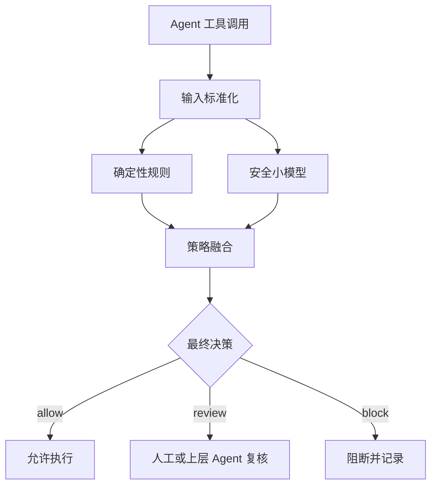

# Agent Security Guard 总体技术方案

## 1. 建设目标

构建一个可在企业 Agent 执行工具前本地运行的轻量级安全护栏。系统接收命令、脚本或结构化工具调用，结合确定性规则和小模型语义判断，输出固定格式的风险类别、严重度、摘要、置信度及 `allow`、`review`、`block` 三态决策。

首选基础模型为 Qwen2.5-1.5B-Instruct，目标设备为 6GB 显存的 NVIDIA RTX 1000 Ada Laptop GPU。模型权重由部署环境单独管理，不进入代码仓库。

## 2. 设计原则

- 执行前检测：Guard 只分析行为，不执行待检测内容。
- 分层防御：确定性高危模式交给规则，复杂语义交给模型，策略层统一决策。
- 契约优先：训练、评估、服务和 SDK 使用同一组版本化数据契约。
- 默认安全：解析失败、超时或证据不足时进入人工复核，不静默放行。
- 可解释可审计：保留规则命中、关键证据、模型与策略版本。
- 离线可部署：核心检测链路不依赖云端大模型或外部服务。

## 3. 总体架构

## 4. 核心模块

| 模块 | 职责 | 主要产物 |
| --- | --- | --- |
| 输入标准化 | 统一 Shell、PowerShell、CMD、Python 和工具参数 | `GuardRequest` |
| 规则引擎 | 识别远程直执行、破坏性删除、凭据读取等确定模式 | 规则命中与证据 |
| 模型推理 | 理解上下文、意图、数据流和组合行为 | 分类、摘要、置信度 |
| 策略融合 | 结合规则、模型、主体、资产和允许列表决策 | `GuardResult` |
| 评估系统 | 计算分类、安全、格式和性能指标 | 版本化评估报告 |
| 服务与 SDK | 提供本地 API 和 Agent 接入层 | HTTP/进程内接口 |

## 5. 数据契约

请求至少包含工具类型和原始命令；上下文可补充工作目录、主体、权限、工具名和来源。输出 Schema V1 包含：

- `risk`：是否存在需处置风险。
- `decision`：`allow`、`review`、`block`。
- `severity`：`none`、`low`、`medium`、`high`、`critical`。
- `category`：风险分类 V1 的 12 个稳定标识之一。
- `summary`：不超过 30 个字符的中文摘要。
- `confidence`：0 到 1 的置信度。
- `evidence`、`rule_hits`：解释与审计信息。
- `model_version`、`policy_version`：结果可追溯信息。

## 6. 检测与决策策略

### 6.1 规则层

规则优先覆盖低歧义、高影响行为，例如远程内容直接进入解释器、递归删除关键目录、关闭安全软件、读取已知凭据位置。规则必须记录标识和证据，并区分检测与最终决策，避免单关键词误杀。

### 6.2 模型层

基线阶段通过固定系统提示和低温度生成结构化 JSON。训练阶段使用 QLoRA/SFT，使模型学习风险边界、困难负样本、上下文差异和稳定格式。模型不得将待检测文本视为指令。

### 6.3 融合层

- 明确的 critical 阻断规则可以直接 `block`。
- 规则与模型一致时提高置信度。
- 结果冲突、解析失败、上下文不足时进入 `review`。
- 企业允许列表只能精确匹配受控主体、资源和参数，不做宽泛字符串豁免。

## 7. 数据方案

先建设 100 条 Evaluation Dataset V1，评估集冻结后才生成训练数据。样本覆盖 Shell 30、PowerShell 20、CMD 10、Python 30、混合脚本 10；同时包含危险样本、正常样本、边界样本和 Prompt Injection 样本。

训练集由模板、公开安全知识、规则变体和 Teacher LLM 辅助生成，经去重、Schema 校验、泄漏检查和人工抽检后使用。训练集、验证集、评估集按攻击族和语义模板分组切分，避免仅参数不同的近重复样本跨集合泄漏。

## 8. 训练方案

- 基础模型：Qwen2.5-1.5B-Instruct。
- 方法：4-bit NF4 量化基础模型 + LoRA Adapter + SFT。
- 6GB 显存策略：短序列、小 batch、梯度累积、梯度检查点和 8-bit optimizer。
- 训练输出：Adapter、训练配置、数据版本、指标和模型卡。
- 是否合并权重由部署方案决定；默认保留基础模型与 Adapter 分离。

## 9. 评估体系

| 维度 | 指标 |
| --- | --- |
| 风险检测 | Precision、Recall、F1、FPR、FNR |
| 多分类 | Macro-F1、各类别 Recall、混淆矩阵 |
| 决策质量 | block/review/allow 准确率，critical 漏报率 |
| 输出质量 | JSON 合规率、Schema 合规率、摘要长度合规率 |
| 鲁棒性 | 编码、混淆、分段、Prompt Injection 和跨语言变体 |
| 性能 | P50/P95 延迟、tokens/s、显存和吞吐 |

安全验收优先级为：降低 critical 漏报，其次控制正常业务误杀，再优化总体准确率。具体阈值在 Evaluation Dataset V1 人工复核后冻结。

## 10. 部署与运维

首期采用单机本地服务，模型常驻 GPU，规则和策略支持版本化热更新。每次判定记录请求摘要、结果、耗时、规则和版本；敏感命令日志应脱敏并设置保留周期。服务必须设置超时、并发上限和健康检查，异常时采用 `review` 或企业配置的 fail-closed 策略。

## 11. 主要风险与缓解

| 风险 | 缓解措施 |
| --- | --- |
| 正常命令误报 | 大量困难负样本、上下文标注、规则精确化、三态决策 |
| 高危组合漏报 | 数据流样本、规则兜底、攻击变体与红队评估 |
| 输出格式漂移 | Pydantic Schema、约束解码、失败重试与安全兜底 |
| 评估集泄漏 | 攻击族分组切分、近重复检测、冻结评估集 |
| 6GB 显存不足 | 4-bit QLoRA、短序列、梯度累积、分阶段训练 |
| Prompt Injection | 数据与指令隔离、静态解析、注入专项测试 |
